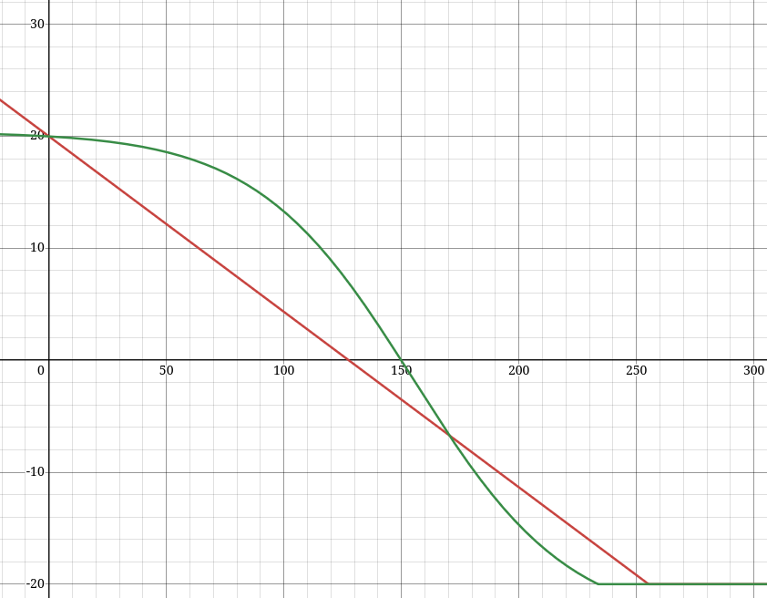

This is a mod for the game Vintage Story that tweaks the elevation temperature gradient to be a sigmoid curve
rather than linear. In practice this means temperature decreases very slowly with elevation for the first 100 or so
blocks, then decreases steeply and then levels off again.

The values are optimized for 320 world height.

https://www.desmos.com/calculator/tlizehxfmy

